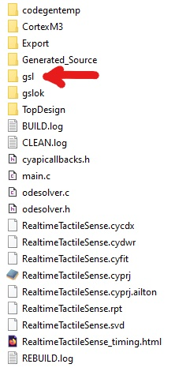
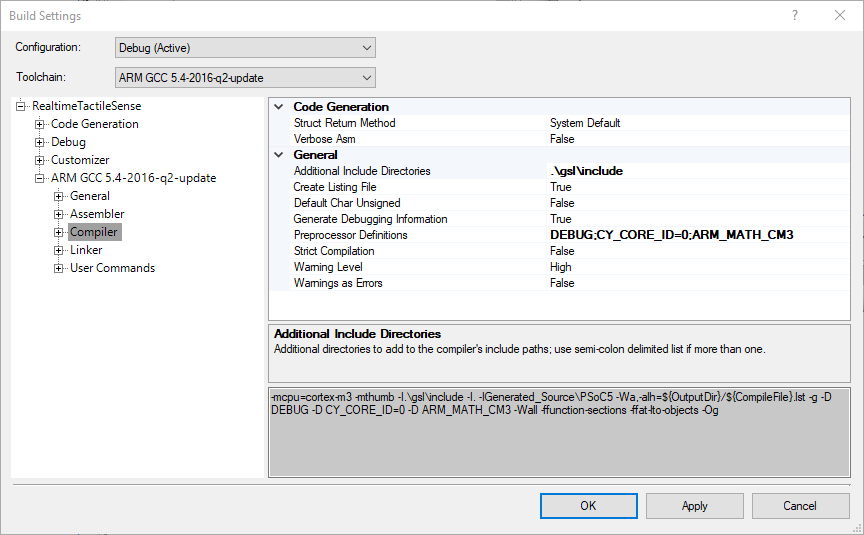
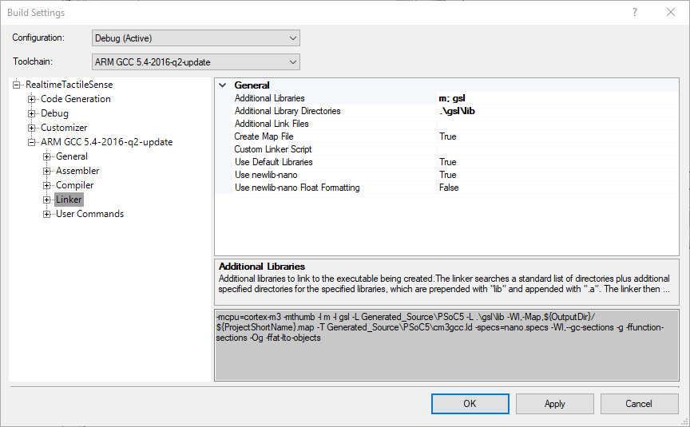

# Usando a biblioteca GNU Scientific Library - GSL com PSoC (ARM Cortex-M3)

Esse projeto descreve como compilar e utilizar a biblioteca GNU Scientific Library (GSL) com processadores ARM Cortex-M3 e a plataforma PSoC.

## Plataforma utilizada

1. GNU GSL versão 2.7
2. Linux Mint 19.2 (Compilação da Biblioteca).
3. GNU Tools for Arm Embedded Processors 7-2018-q3-update -  7.3.1 20180622 (release) [ARM/embedded-7-branch revision 261907] (Compilação da Biblioteca).
4. PSoC Creator 4.4 no Windows 10 (Integração com o PSoC).
5. CY8KIT-059 PSoC 5LP Prototyping Kit.

## Procedimento para compilar a biblioteca

O procedimento para compilar a bilioteca é composto das seguintes etapas:

1. Instalação do GCC para ARM.
2. Download da biblioteca GNU GSL.
3. Configurar, compilar e instalar.

Abaixo é apresentado os comandos no terminal necessários para realizar essa operação:

```sh
# Instala o GCC para ARM.
sudo add-apt-repository ppa:team-gcc-arm-embedded/ppa
sudo apt-get update
sudo apt-get install gcc-arm-embedded

# Faz o download da biblioteca GSL e descompacta na subpasta gsl
wget -c https://mirror.ibcp.fr/pub/gnu/gsl/gsl-latest.tar.gz
tar xvfz gsl-latest.tar.gz
# Após esse comando, foi criado o diretório gsl-2.7. O diretório pode mudar de acordo com a versão.

#Cria um diretório para salvar a biblioteca compilada
mkdir gslbin
#Entra no diretório da biblioteca. Pode mudar de acordo com a versão.
cd gsl-2.7

#Configura
#Você pode alterar o diretório onde a bilioteca será salva com a pasta definida no argumento --prefix
./configure --host=arm-none-eabi --prefix=../gslbin  LDFLAGS="-lc_nano -lnosys -specs=nosys.specs" --disable-shared --enable-static  CFLAGS="-mcpu=cortex-m3 -DSIZEOF_LONG=4 -DSIZEOF_LONG_LONG=8"
#Compila
make
#Opcional - Testa
make check
#Copia a bilioteca para a pasta gslbin
make install
```

Ao final, a biblioteca estará no diretório **gslbin**.

## Configuração do PSoC Creator

Copie a pasta **gslbin** para o seu projeto. Renomeie essa pasta para **gsl** apenas. A Figura1 ilustra como ficou no meu projeto.



**Figura 1** - Exemplo de estrutura de diretórios de um projeto do PSoC com a biblioteca GNU GSL.

Em seguida você deve configurar o compilador e o linker para utilizar essa bibliotca. 

### Configurando as opções do compilador

Clique com o botão direito no seu projeto e no menu escolha a opção *Build Settings...*. Em seguida expanda a seção para o compilador *ARM GCC* -> *Compiler* -> *General* (Figura 2).



**Figura 2** - Configuração do compilador.

As seguintes configurações devem ser editadas:

1. **Additional Include Directories**: Deve incluir o diretório *Include* dentro da pasta GSL.
2. **Preprocessor Definitions**: Deve-se adicionar a definição *ARM_MATH_CM3*, correspondente ao processador Cortex-M3 do PSoC 5lp.

### Configurando as opções do *linker*

Em seguinda deve-se configurar o Linker. De maneira semelhante, devemos acessar o menu *Build Settings...* e em seguida a seção *ARM GCC* -> *Linker* -> *General* (Figura 2).



**Figura 3** - Configuração do *linker*.

As seguintes configurações devem ser editadas:

1. **Additional Libraries**: Deve-se adicionar a definição *m* e *arm_cortex_M3l_math*, também correspondentes ao processador ARM Cortex-M3.
2. **Additional Library Directories**: Deve incluir o diretório *Lib\GCC* do CMSIS.

## Observações do processo

O mais complicado do processo é conseguir compilar corretamente a biblioteca. Para esse projeto foi executado um processo de tentativa e erro até conseguir fazer a biblioteca funcionar. Alguns detalhes ainda não estão totalmente claros para mim.

Para compilar o GNU GSL para os microcontroladores ARM é necessário utilizar um conjunto de opções e parâmetros durante a etapa de configuração. Nesse processo ocorre um processo de compilação cruzada (*cross-compilation*) e a documentação do GCC e do automake não é muito clara. As configurações definem diversos elementos desse processo de compilação cruzada como tipo de processador, arquitetura e outros detalhes.

Esse projeto realiza a compilação para arquitetura ARM embarcada (Cortex-M) e não sei se o mesmo pode ser aplicado para o Cortex-A. Aqui serão apresentados alguns detalhes e links para páginas onde parte dessa solução foi encontrada. Isso pode ajudar a adaptar esse processo para outras CPUs e arquiteturas.

A compilação cruzada define três elementos: o *host*, o *target* e o *build*. Pelo que entendi o *build* corresponde a máquina que executa o compilador, o *host* a máquina que vai receber o código e o *target* à arquitetura para o qual o código será compilado. Para mim, o *host* e o *target* são a mesma coisa, mas durante minhas leituras vi alguns exemplos em que podemos ter três arquiteturas diferentes. Talvez para o caso de uma máquina virtual. As referência [2] e [3] detalham isso.

No meu caso eu estou compilando o código em uma máquina padrão x86/AMD64 para uma máquina ARM Cortex-M3. Nesse caso, o *host* e o *target* corresponderiam ao processador ARM e o build ao x86/AMD64. Observe que no comando configure eu defino o *host*, e parece que ele automaticamente já define também o *target*. O *build* também é definido automaticamente. Mas em determinados casos, pode ser necessário definir isso manualmente.

Existe uma convensão de como é informada a arquitetura/subsistema dos elementos *host*, *target* e *build*. Basicamente se utiliza a sequência arquitetura-fornecedor-sistema_operacional-eabi. O eabi vem de Embedded Application Binary Interface, e parece ser específico para aplicações embarcadas. Alguns elementos podem ser suprimidos. No caso do arm-none-ebai temos que a arquitetura é ARM, não especificamos o fornecedor nem o sistema operacional e temos um binário para sistemas embarcados. Detalhes podem ser encontrados nas referências [5].

Mesmo passando o parâmetro *host* como *arm-none-eabi* em algumas situações o compilador gerava código para x86/AMD64. Você pode verificar a arquitetura da biblioteca gerada com o seguinte comando. Ele irá informar para qual arquitetura a biblioteca foi compilada.

```sh
readelf -h libgsl.a | grep 'Classe\|Arquivo\|Máquina' 
```

Ao que parece o compilador gcc é muito ligado ao padrão Unix. As bibliotecas assumem que você está executando sobre um sistema operacional, onde tem acesso a um terminal para saída padrão e uma biblioteca C completa. Isso é necessário para definir a saída para funções como o *printf* e quais as funções da libc estarão disponíveis. Como estamos trabalhando com um dispositivo embarcado, não temos a presença de um sistema operacional e em alguns casos memória para executar a libc completa. E por isso é preciso informar isso para o compilador.

A definição de ambientes especiais é feita usando os parâmetros do linker (LDFLAGS). A referência [4] detalha um pouco disso. Através desses parâmetros é possível determinar qual o ambiente o seu programa irá encontrar durante a execução. Por padrão, espera-se um ambiente completo, com a libc completa e um sistema operacional Unix. Esse não é o caso de aplicações de microcontroladores. Através dos parâmetros podemos especificar outros tipos de ambiente. Ao que parece exitem 3 diferentes ambientes especiais:

1. **nosys** - Pelo que entendo significa que você não tem um sistema operacional nem uma interface padrão de saída.
2. **rdimon** - Assume que existe uma interface de saída apenas para depuração.
3. **nano** - Parece estar relacionada com a libc. Utiliza uma versão menor da libc, o que é ideal para sistemas embarcados.

No caso do PSoC consegui executar a biblioteca GNS GSL usando os ambientes *nosys* e *rdimon*. O padrão *nano* também foi utilizado pois verifique que isso está habilitado por padrão nas configurações do compilador no PSoC Creator (Ver Figura 3 - Opção *Use newlib nano*). Os parâmetros *--disable-shared* e *--enable-static* também parecem ajudar, permitindo um linker estático e desabilitando o compartilhamento de uma biblioteca, típico do sistema operacional. Não testei a remoção desses parâmetros.

Por fim, foram definidos alguns parâmetros do compilador (CFLAGS). O principal é a definição da cpu cortex-m3. Acredito que isso possa ser alterado para outra cpu da linha cortex-m, como por exemplo cortex-m4 para adaptar o processo para outra placa de desenvolvimento como o PSoC 6 ou STM32F4. Não sei se a especificação do tamanho padrão de inteiros também é necessária.

## Referências

1. GNU Scientific Library (GSL) - https://www.gnu.org/software/gsl/
2. The GNU Project Build Tools - Capítulo 26 - Cross Compilation with GNU Autotools - https://www.sourceware.org/autobook/autobook/autobook_139.html#Cross-Compilation
3. How to Survive Embedded Linux: How to Compile - https://www.bytesnap.com/how-to-survive-embedded-linux-how-to-compile/
4. What are “nosys”, “nano”, “rdimon” terms when using ARM GCC? - https://stackoverflow.com/questions/65453293/what-are-nosys-nano-rdimon-terms-when-using-arm-gcc
5. The difference between arm cross compiler gnueabi, none-eabi, arm-eabi, gnueabihf - https://www.programmersought.com/article/23896474337/